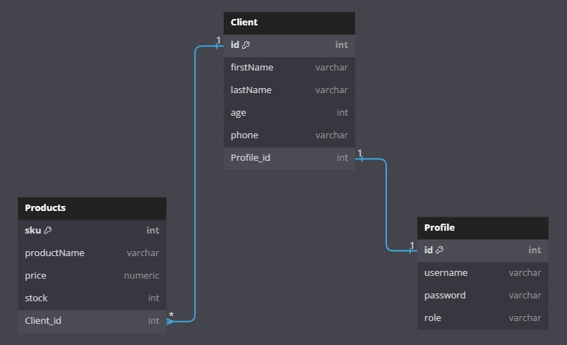

# Technical-Mock-Test-API

### Developed in
 

TypeScript with Node.js, Express.js and TypeORM

### FrontEnd

React App

# DB Diagram

# How to use
- Clone the repository.
- Create a PostgreSQL database or your favorite relational database.
- Modify the `AppDataSource` function with your database details in the `db.ts` file.
- Install npm dependencies.
- Use `npm run dev`.
- (When starting the server with `npm run dev`, if the connection to your database is correct, TypeORM will create tables in your database as defined in the `entities` folder.)
